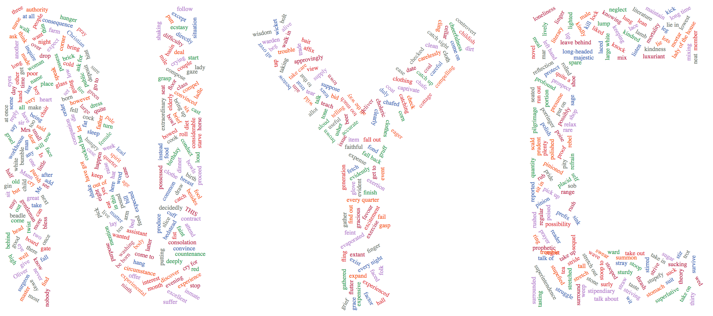

# d3-letters-of-word-cloud
This is a Javascript API developed using D3.js, d3.wordcloud.js, and d3.layout.cloud.js. You can use this tool to render words that consist of word clouds (wordles) like this:



## Getting started

To get the full package of this Javascript library, you will need a set of other libraries. To install, you have two options:

### 1. Download the dependent libraries

* [jQuery](https://jquery.com/download/) - A feature-rich JavaScript library that enables easier Javascript coding.
* [D3.js](https://github.com/d3/d3) - Brings data to life with SVG, Canvas and HTML.
* [d3.layout.cloud.js](https://github.com/jasondavies/d3-cloud) - A fantastic JS library to generate word clouds by Jason Davies.
* [d3.wordcloud.js](https://github.com/wvengen/d3-wordcloud) - A library that enables easier utilization of "d3.layout.cloud.js".

After you have downloaded all the JS files, simply add the following lines to the head in your HTML file(s).
```
<script src="javascripts/jquery.min.js"></script>
<script src="javascripts/d3.js" charset="utf-8"></script>
<script src="javascripts/d3.layout.cloud.js"></script>
<script src="javascripts/d3.wordcloud.js"></script>
```
Please make sure your file paths are correct before running the scripts.

### 2. Load the online version of the scripts

A simpler way to integrate the dependencies is to directly load the online version of them. (However, you will probably not able to find some of the libraries).

```
<script src="https://code.jquery.com/jquery-1.x-git.min.js"></script>
...
```

### More dependency files

Also make sure these files are integrated somewhere in your repository:

```
<script src="javascripts/letter-components.js"></script>
<script src="javascripts/example.words.js"></script>
<script src="javascripts/word-cloud-letters.js"></script>
```

## Usage

You need to have a DOM element to render the words of word clouds. For example:
```
<div id='example'></div>
```
Next, a bag of words is needed to render the word cloud. An example of word list is in "javascripts/example.words.js":
```
var words = [
  {text: 'have', size: 1},
  {text: 'Oliver', size: 1},
  {text: 'say', size: 1},
  {text: 'said', size: 1},
  ...
  ];
```
The more words in the array, the better visualization is rendered.

Now it is time to determine word(s) you are rendering. For example, if "XW" is what you would like to render, just add the following lines to your HTML file:
```
<script>
  var div = 'example';
  var pattern = "XW"; // Your word go here!
  wordle(div, words, pattern);
</script>
```
Hope you enjoy the word clouds!
